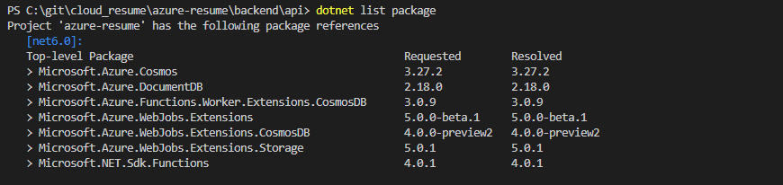

## Wow! What a challenging Azure Cloud Resume project!

[View my cloud resume website here!](https://www.anupk.me)

### Introducing the Challenge
The challenge is to build an online resume and host it all in Azure. To accomplish this there are many steps that need to be taken, and some coding needs to be completed. This isn’t something simple like uploading a PDF and storing it somewhere in Azure! 🙂

This is what I needed to accomplish:
- I need to build a website that contains my resume information using HTML, CSS, and JavaScript.
- The website must contain a visitor counter written in JavaScript that communicates with a CosmosDB database via an API.
- The API is created with Azure Functions, which happens to be a serverless one with an HTTP trigger
- Integrate Azure Functions and CosmoDB via bindings
- The static website should be deployed to Azure Blob storage
- Use Azure CDN to point the custom domain to the static website
- All the code has to be stored in a GitHub repository.
- A GitHub Action must be set, so that when you commit changes to the code, these are automatically deployed to production.
- There should be a test procedure to test your API code, and this should also be automated via GitHub Actions.

I also needed to install the following Extensions:
- [Visual Code Extensions](https://code.visualstudio.com/docs/introvideos/extend)
- [Azure Functions Extensions](https://marketplace.visualstudio.com/items?itemName=ms-azuretools.vscode-azurefunctions)
- [C# Extension](https://marketplace.visualstudio.com/items?itemName=ms-dotnettools.csharp)
- [Azure Storage Extension](https://marketplace.visualstudio.com/items?itemName=ms-azuretools.vscode-azurestorage)

Here is the visual diagram of all this: 

### Why did I participate in the challenge?
After obtaining a couple of [certifications](https://www.credly.com/users/anup-kinkhabwala/badges), I wanted to work on a project where I can learn how to implement the different concepts I learned. Enterprises around the world are adopting cloud computing and Azure happens to be one of the leading platforms at the forefront of this movement. I took on the challenge to learn how to use Azure hands on and to start a career in cloud computing. In addition, this challenge will help me complete my first ever cloud project which will highlight my knowledge of various Azure tools, and how I put them to practical use.

### How did you complete the challenge? 
Being new to all of this, I started out with downloading Visual Studio Code, creating a new Azure Subscription, downloading [Node.js 18.4](https://nodejs.org/en/download/current/), and setting up my GitHub account. Also, I needed to download and install [.Net 6.0.](https://dotnet.microsoft.com/en-us/download/dotnet/6.0)

#### Phase 1: Creating Frontend
For my resume website, I used decided on using a template since I am not an expert on HTML & CSS. The last time I used HTML was during college. The template was from [StyleShout](https://www.styleshout.com/free-templates/ceevee/) that consisted of HTML and CSS. The first issue I encountered was my picture was off and very stretched. I ended up modifying the width and height to make it look better. I customized the HTML and CSS to change the background to fit my theme of cloud computing and then began adding all of my information. I also did my best to create a favicon for Credly and added that to my website. 

#### Phase 2: Creating Backend
The next part I created a Core (SQL) Azure DB Cosmos [account](https://docs.microsoft.com/en-us/azure/cosmos-db/sql/create-cosmosdb-resources-portal) with a capacity mode of serverless. I then went to Data Explorer and created a new database and a new container. I named the container ID of “Counter” and a partition key of “/id”. I added the items to the container called “id” and “count”.

Next, I created a Function, and connected Azure CosmosDB bindings to the function and then viewing the counter data via the function. I created my Azure Function using the VS Code extension and created a GetResumeCounter.cs file with C#. I tried the “func host start” command but it did not work. I did some googling and figured I needed to install [Azure Functions Core Tools.](https://docs.microsoft.com/en-us/azure/azure-functions/functions-run-local?tabs=macos%2Ccsharp%2Cbash#install-the-azure-functions-core-tools) Then it still would not work so I spent another day googling and found I had to change a setting in Windows to give myself the privilege of using that command. I had to change the [Execution Policy]( https://docs.microsoft.com/en-us/powershell/module/microsoft.powershell.core/about/about_execution_policies?view=powershell-7.2 ) for running scripts since I was restricted. It finally ran and I was able to continue progressing by modifying the GetResumeCounter.cs.

Next I began working on the bindings by reviewing this documentation on [Azure Functions Cosmos DB bindings](https://docs.microsoft.com/en-us/azure/azure-functions/functions-bindings-cosmosdb-v2). Next, I installed the NuGet package for [CosmosDB](https://www.nuget.org/packages/Microsoft.Azure.WebJobs.Extensions.CosmosDB#versions-body-tab)

In local.settings.json file I pasted my Primary connection string from Azure Keys.

>This where I ran into another problem where I had mistakenly did a ‘pull’ and lost my GetResumeCounter.cs file on my computer. Also, I had a main branch and a master branch on my GitHub and when I pushed it went to master branch. I felt something was wrong so I deleted everything, started over, and learned why I had a master branch. Next time around when I created my repository I made sure I pulled it to the folder right away and then began working on that folder.”
Now once I got back to where I was I ran into another issue, which took me about 3 days to figure out from trying random things and googling.

That problem involved a bunch of underlines in the GetResumeCounter.cs file, which indicates there is an error. I tried updating all of the packages and restarting and still it would not go away, therefore would not compile.

> I tried installing more NuGet Packages which I thought would help with fixing the issues from StackSocial.  On the third day, I decided I would get a Package Manager and uninstall all of the extensions. I installed  the NuGet package ver 4, preview 3 & then 2 for [CosmosDB](https://www.nuget.org/packages/Microsoft.Azure.WebJobs.Extensions.CosmosDB#versions-body-tab). It didn’t work but finally when I tried version 3.0.10 it finally worked and made the underlines go away!”

I created my Azure Function using the VS Code extension, so the back-end is an [HTTP triggered Azure Function](https://docs.microsoft.com/en-us/azure/azure-functions/functions-bindings-http-webhook-trigger?tabs=csharp) with Cosmos DB [input]( https://docs.microsoft.com/en-us/azure/azure-functions/functions-bindings-cosmosdb-v2-input?tabs=in-process%2Cfunctionsv2&pivots=programming-language-csharp) and [output]( https://docs.microsoft.com/en-us/azure/azure-functions/functions-bindings-cosmosdb-v2-output?tabs=in-process%2Cfunctionsv2&pivots=programming-language-csharp) binding. Input bindings are data that the function receives and output bindings are data that a function sends. The Function is triggered, it retrieves the CosmosDB item, adds 1 to it, and saves it and returns its value to the caller. Functions are triggered by events, and in this case the event is an HTTP request. Every time a client makes a request to our resume, that function is invoked. Once I had Counter.cs created I was able to get my Azure Function working with the CosmosDB binding. I also added [CORS]( https://docs.microsoft.com/en-us/rest/api/storageservices/cross-origin-resource-sharing--cors--support-for-the-azure-storage-services) to local.settings.json. Also I added the local link to main.js file and the website was workikng.

#### Phase 3 : Azure Deployment
Once everything was working locally, I was tried to deploy to Azure using VS Code. I followed the steps, created a new Azure storage account, and created an Application Insights. After about a minute it did not deploy to the Function app. 
> Since it did not deploy to the Function app I did some googling and figured out that I should run a ‘donet clean’ and then a ‘dotnet build’ commands in the api folder. I was able to see the Function in the list for the local folder but still could not deploy it. The other error I was getting when I went to Deploy to the Function app was “Failed to deploy path that does not exist: \backend\api\bin\Release\net6.0\publish”. After another day I of trying to figure it out I randomly ran the Command Palette and then typed: >Azure Functions: Initialize Project for use with VS Code. 
I was finally able to deploy! Then I went to the Function that was created in Azure, went to Configuration and added a new application setting with the Primary Connection String. Now that I have a new Function production URL I added that to main.js file. I also enabled CORS in the Function App in Azure.
Next was to deploy the frontend to Azure Storage by right clicking Frontend folder and selecting Deploy to Static Website via Azure Storage. When I tried to do it I ran into another error: “Could not find $web blob container for storage account "(name of my storage account)".
> This error would not let me deploy the website. It took me another day of googling and searching to try to figure it out. Below is what I was seeing when logging into Azure in VS Code, where I only see Functions app and nothing else.

> Below is what I expected to see:

> After a day I randomly tried next to the name of my project, the + sign it says "Group By" and then I selected Group By Resource Type. Once I did that all of the Azure Resources showed up. Then I tried deploying the website again, and it worked!

#### Phase 4: Creating CDN and Enabling HTTPS
In this phase, I knew I was finally getting to the finish line. I created a static CDN endpoint in Azure Storage and then enabled HTTPS. I bought my domain from Namecheap. To add the custom domain to the CDN endpoint, I first had to go to the DNS provider (Namecheap) and create a CNAME (canonical name) record that mapped the domain name to the Azure CDN instance.  Back in the Azure Portal, now I needed to associate the custom domain to the CDN endpoint. I navigated to the CDN Profile resource, click on the endpoint created previously and add the custom domain. Finally, I added hostname (www.anupk.me) to CORS in Function App so the counter will show up.

One thing that was annoying was if someone went to the HTTP website they would just see the error page and it would not redirect to HTTPS. I did some googling and found [documentation]( https://docs.microsoft.com/en-us/azure/cdn/cdn-standard-rules-engine) on using the Azure CDN rules engine. Once I followed those steps, I was able to always have HTTP redirect to HTTPS. Finally, I enable HTTPS by pointing the custom domain to my static website.

#### Phase 5: Setup Continuous Integration/Continuous Delivery (CI/CD) Pipeline with GitHub
In the final phase, I want to ensure that any changes that I make moving forward will be automatically pushed via GitHub to Azure. With CI/CD, it will create a workflow for the Frontend, implement testing, and create a Backend workflow. First thing I had to make sure of was installing the Azure CLI. The Microsoft Documentation offers a great tutorial on [how to set up a GitHub Actions workflow to deploy a static website in Azure Storage]( https://docs.microsoft.com/en-us/azure/storage/blobs/storage-blobs-static-site-github-actions), and I followed it.

#### What was the hardest part?
I would say the hardest part was figuring out the coding. I made a bunch of minor syntax errors which took time to figure out. Overall it took me around 3 weeks to complete with all of the issues I ran into and had to figure out. To me that is usually the best way you learn, from your mistakes.

#### Which part did you enjoy the most?
The part I enjoyed the most is customizing the HTML and CSS to fit how I wanted the website to look. The last time I was using HTML was in college when I worked on my MySpace page using Microsoft Frontpage. 

#### What are your biggest takeaways?
As this was my first ever completed cloud project, I have a great sense of accomplishment. The most important takeaway for me is to have learned more about Azure Functions, Azure Storage, Azure CosmosDB, and Azure CDN. I also was introduced to how GitHub and VS Code work. I think by doing this project I was able to learn a lot compared to watching videos or reading articles. 
Thank you to 'A Cloud Guru', StackSocial for having clues to help me diagnose my issues, and Gwyn Peña-Siguenza, who wrote the challenge. My cloud learning journey continues…

