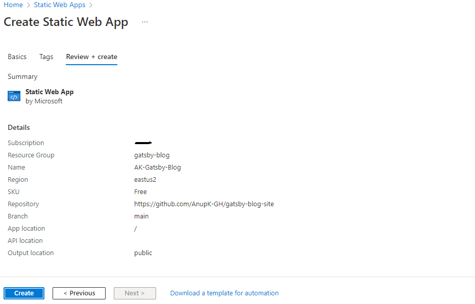

### Introduction to the Gatsby Blog Site


I knew after the first two cloud projects I completed, I needed a blog to write about my experience. I didn’t want to design a whole new website, but I knew I wanted to use [Azure Static Web Apps]( https://docs.microsoft.com/en-us/azure/static-web-apps/overview). Azure Static Web Apps is “a service that automatically builds and deploys full stack web apps to Azure from a code repository.” I wanted to use that because I wanted to see how it would work because with the Cloud Resume, I could have used it but then I would not have learned all the detailed steps which I undertook to learn the different aspects of Azure.

I wanted to find something simple where a template already existed for the blog site, and all I had to do was configure it, modify the content, and deploy it using Azure Static Web Apps. I found my solution on the [Microsoft Developers Youtube page](https://www.youtube.com/watch?v=IZbcpUIke8s), which had an explanation to complete what I wanted to accomplish.

As a result, I undertook my 3rd cloud project of creating a Gatsby blog site. [Gatsby]( https://www.gatsbyjs.com/) is an open-source static website generator (SSG) that is based on the frontend development framework React and makes use of Webpack and GraphQL technology. It can be used to build static sites that are web apps, following the latest web standards, and optimized for speed and security.


You can check out my blog site before reading about how I created it: https://blog.anupk.me


###### 1) Get the template and set up GitHub repository

I first downloaded the template and then set up my GitHub repository. I cloned the repository to my desktop.
Here is my [repository](https://github.com/AnupK-GH/gatsby-blog-site).


###### 2) Next I installed Gatsby and ran a local build

To install Gatsby I ran the command:  ```npm install Gatsby-cli -g```

Next after added all the files from the template I ran another command: 

```npm install ```

That installed any of the required node modules that will power my Gatsby website. 

Finally I typed  ```gatsby develop``` , and then I was able to see my local build here: http://localhost:8000.


###### 3) Spend time writing the blog

I spent around four days writing the blog entries for three cloud projects and the first Hello World entry.


###### 4) Push changes to GitHub

I pushed all of the latest changes to GitHub.


###### 5) Push changes to GitHub

I pushed all of the latest changes to GitHub.


###### 6) Go to Static Web App in Azure to create the site

I created a new Static Web App named : AK-Gatsby-Blog
I added a new resource: gatsby-blog
I selected the plan type as Free and then logged into GitHub to authorize the authentication.



I waited a few minutes for it to be created because the GitHub Actions workflow were working to deploy as seen in the picture below. After a few minutes it was successful and I was able to see my blog site on the Azure generated URL. Now I had to create a Custom Domain to be able to point to my ‘anupk.me’ domain.


###### 7) Create the Custom Subdomain

At first I wasn’t sure what to do next since I wanted to point the Azure generated URL to ‘blog.anupk.me’. I did some googling and found some documentation from Microsoft for [Custom Domains]( https://docs.microsoft.com/en-us/azure/static-web-apps/custom-domain-external).
I generally followed the video and in Static Web Apps, because it was creating a root domain and I wanted to create a subdomain. I figured I should try with just the subdomain link first and see what happens. So, I went to Custom Domains and clicked ‘Add’ to “Add a custom Domain on other DNS”. 

In NameCheap I went to Advanced DNS, and added a Type-ALIAS, host- blog, Value-(the azure generated URL), and the TTL – Automatic.

Next, I added ‘blog.anupk.me’ for the Domain, and then selected CNAME. Once it was ready I had to configure the root domain of ‘anupk.me’. I clicked ‘Add’ to “Add a custom Domain on other DNS”. Now I added ‘anupk.me’ and then validate that I own the domain by creating a TXT record with NameCheap. Once you click Generate code, wait a few minutes for it to show up so then you can add it to NameCheap Advanced DNS.

Then, I went back to NameCheap I went to Advanced DNS, and added a Type-TXT Record, host- @, Value-(the azure generated code), and the TTL – Automatic. 

After about 10 minutes I thought I did something wrong, but the video did say it can take time. So then I waited 30 minutes and then the subdomain of ‘blog.anupk.me’ began working!!


#### What are your biggest takeaways?

The most important takeaway for me is to have learned more about Azure Static Web App, Custom Domains, Gatsby, and the [Markdown language]( https://www.markdownguide.org/). Also now I have a working site I can upload my blogs! The process of creating the Gatsby site with a template was very straightforward and doing minor modifications to the gatsby-config.js file to change some settings helped me learn some basics. I also learned how to create a Static Web Site and create a custom domain for it. The only thing that took me time was writing the posts and remembering what I did for the other projects. Thank you to ‘Microsoft Developers’ channel on Youtube. My cloud learning journey continues…
