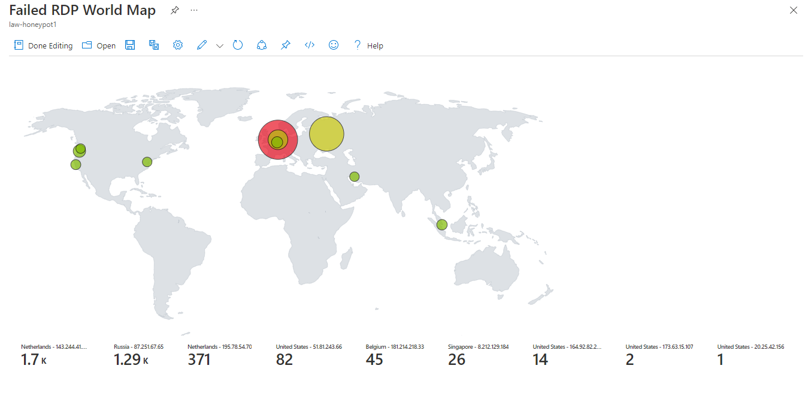

### Introduction to the Honeypot Lab
In computer security terms, a honeypot is a bait trap for hackers or malicious actors. It is a computer system that’s intended to attract cyberattacks, like a decoy. It mimics a target for hackers, and uses their intrusion attempts to gain information about cybercriminals and the way they are operating or to distract them from other targets. Honeypots are made attractive to attackers by building in deliberate security vulnerabilities. In this lab we will open up all the ports and allow the virtual machine (VM) to be pinged to be easily discoverable.

I setup Microsoft Azure Sentinel (SIEM) and connect it to a virtual machine, created in Azure, acting as a honey pot. Microsoft Sentinel is a “scalable, cloud-native, security information and event management (SIEM) and security orchestration, automation, and response (SOAR) solution”. Microsoft Sentinel delivers intelligent security analytics and threat intelligence across the enterprise, providing a single solution for attack detection, threat visibility, proactive hunting, and threat response. Once it is all set up, we will observe live attacks (RDP Brute Force) from all around the world. Brute-forcing RDP (Remote Desktop Protocol) is one of the most common methods used by threat actors attempting to gain access to Windows systems and execute malware. The reason is simple since a large percentage of systems keep the RDP ports open in the public cloud. 

Once everything is set up, I will use a a custom PowerShell script to look up the attackers Geolocation information and plot it on the Azure Sentinel Map. The Geolocation will be found using a free 3rd party API called “ipgeolocation.io”. The API provides data such as country, city, state, province, latitude and longitude, time zone, and current time.


### Why did I participate in the lab?
After obtaining a certifications for Security+ and Security Operations Analyst (SC-200), I wanted to work on a project where I can learn how to implement the different topics I learned. Some of these topics were Powershell, Log Analytics workspace, Sentinel, VMs, and Kusto Query Language (KQL). I felt like this lab would be similar to something that would occur in real life for a cloud security engineer, so that is why I wanted to try it out.


#### All the steps taken to create the Honeypot Lab

Below are the detailed steps I took to create this lab.


###### 1) Create the Virtual Machine (VM)

First step was to create a virtual machine (honeypot-vm) in a new resource group called “honeypotlab”.
The first issue I ran into was finding a size for the VM since it was not unavailable at the location I had selected. I selected a few different regions but it kept giving me an error and after trying “Central US” a few times it finally worked.


For the NIC Network Security group I selected Advanced and created a new security group. I removed the default inbound rule and created a new one. I changed the port to allow everything so it allows the VM to be easily discoverable. People can be doing TCP Pings or ICMP pings and it allows people to find it and attack it.


###### 2) Create Log Analytics Workspace (LAW) 

Next I created a Log Analytics workspace where we will ingest the Windows event logs and then create custom logs that contain geographic information and discover where the attacks are coming from. Our SIEM (Sentinel) will connect to the workspace to display the geodata.
The name of the workspace is : law-honeypot1


###### 3) I turned on Defender for Cloud for the log analytics workspace


Then for the data collection, I selected All events to help investigate and collect raw events, to save it to my Log Analytics workspace.

###### 4) I connected my virtual machine to the log analytics workspace.


###### 5)  Set up Sentinel to Visualize attack data

Next I set up Azure Sentinel to be able to visualize the attack data. Then I connected to the Virtual machine using remote desktop, by using the IP address. 
Once I connected to the VM, I opened up Event Viewer and checked the Security Events.

I will be focusing on Event ID 4625, which are failures of RDP logins.
To get the IP geolocation information I signed up on this website to use the API: ipgeolocation.io

###### 6) Made sure I can Ping the VM

Next on the VM, I went to ‘wf.msc’ Firewall settings and turned it off. As you can see on the ping, it would not work until I turned it off. Now it will be easier for bad actors to find the VM.


As you can see below, at first the ping timed out, but as soon as I changed the firewall status to “Off” for Domain, Public, and Private profiles, I was able to ping the VM.


###### 7) I created the log exporter file in PowerShell ISE on the VM.

I didn’t include the API key number since I wanted to keep that private, but in the lab the key was there. On top you see the green play button, which is what we will have to press once we have everything else set up.


###### 8) Next, I created a custom Log in LAW named: FAILED_RDP_WITH_GEO.


###### 9)  Now I was able to check the logs and use KQL to search for logs.

As you can see below I searched all the security events where the EventID=4625, and it showed me a list of results. These were mostly my failed logins where I wanted to test the query would work.


###### 10) Next, I had to train the extraction with custom fields.


I trained the algorithm by selecting every field such as longitude, username, country, state, and so on.


###### 11) Set up map in Workbooks

Now I started setting up the map in Workbooks in Sentinel. In the workbook I added a new query.
The query used was:

 ``` FAILED_RDP_WITH_GEO_CL | summarize event_count=count() by sourcehost_CF, latitude_CF, longitude_CF, country_CF, label_CF, destinationhost_CF ```
``` | where destinationhost_CF != "samplehost" ```
``` | where sourcehost_CF != "" ```


###### 12) The map after the first hour


Only 1 real attempt from Iran since the other 2 in the USA are from me.

###### 13) The map after 7 ½ hours

After 7 ½ hours I had actually fallen asleep and woke up in the middle of the night. I checked out what was happening and made sure to save it.


Now I was getting a decent amount of attempts. Examples of what bots/people in different countries are using to log in:

``` latitude:55.87935,longitude:37.54717,destinationhost:honeypotlab-vm,username:Administrator,sourcehost:87.251.67.65,state:Central Federal District, country:Russia,label:Russia - 87.251.67.65,timestamp:2022-06-21 03:01:36
latitude:55.87935,longitude:37.54717,destinationhost:honeypotlab-vm,username:Administrator,sourcehost:87.251.67.65,state:Central Federal District, country:Russia,label:Russia - 87.251.67.65,timestamp:2022-06-21 03:01:34
latitude:55.87935,longitude:37.54717,destinationhost:honeypotlab-vm,username:Administrator,sourcehost:87.251.67.65,state:Central Federal District, country:Russia,label:Russia - 87.251.67.65,timestamp:2022-06-21 03:01:33
latitude:55.87935,longitude:37.54717,destinationhost:honeypotlab-vm,username:Administrator,sourcehost:87.251.67.65,state:Central Federal District, country:Russia,label:Russia - 87.251.67.65,timestamp:2022-06-21 03:01:54
latitude:50.84439,longitude:4.35609,destinationhost:honeypotlab-vm,username:CLOCK,sourcehost:181.214.218.33,state:Brussels, country:Belgium,label:Belgium - 181.214.218.33,timestamp:2022-06-21 07:03:47
latitude:52.37018,longitude:4.87326,destinationhost:honeypotlab-vm,username:USER2,sourcehost:191.96.168.203,state:North Holland, country:Netherlands,label:Netherlands - 191.96.168.203,timestamp:2022-06-21 07:03:42
latitude:52.37018,longitude:4.87326,destinationhost:honeypotlab-vm,username:USER2,sourcehost:191.96.168.203,state:North Holland, country:Netherlands,label:Netherlands - 191.96.168.203,timestamp:2022-06-21 07:03:32
latitude:52.37018,longitude:4.87326,destinationhost:honeypotlab-vm,username:PHARMACY,sourcehost:181.214.206.72,state:North Holland, country:Netherlands,label:Netherlands - 181.214.206.72,timestamp:2022-06-21 07:03:21
latitude:50.84439,longitude:4.35609,destinationhost:honeypotlab-vm,username:DEFAULT,sourcehost:181.214.218.33,state:Brussels, country:Belgium,label:Belgium - 181.214.218.33,timestamp:2022-06-21 06:51:03
```
Russia is using a lot of “Administrator”. Netherlands is using different usernames like CLOCK, USER2, PHARMACY. Finally, Belgium is using “DEFAULT” a lot.

###### 15) The next day I let it run again to use up another 1000 requests on the Geolocation API.


This ran for around an hour for 1000 requests, and as you can see we have a lot more hits where Netherlands took over, and we had some new additions from USA and Singapore.


#### What are your biggest takeaways?
The most important takeaway for me is to have learned more about Azure Sentinel, Log Analytics Workspace, Virtual Machines, and KQL. No matter who you are, if you are on the internet, malicious actors are going to try to try and attack you. So it is always in your best interest to be proactive about your security posture. I think by doing the project I was able to learn more about cloud security related topics, which is the field I am pursuing. Thank you to ‘Josh Madakor’ on Youtube. My cloud learning journey continues…
